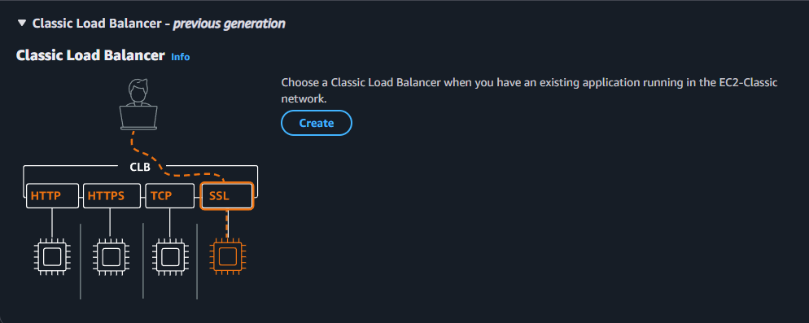
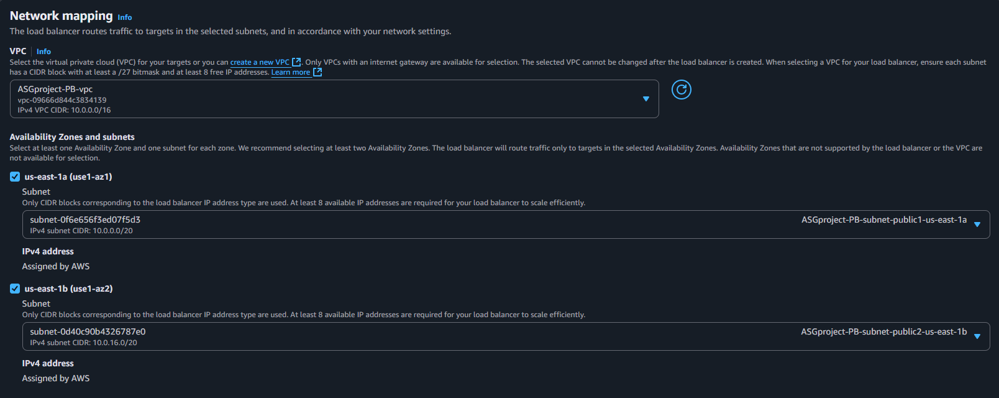

# Estudo de Políticas de Escalonamento `Scale Out` e `Scale In` na AWS
## ✏️ Atividades:
* Criação de uma VPC com duas subnets públicas e privadas;
* Criação de um Security Group genérico;
* Criação de um Classic Load Balancer;
* Criação de um Auto Scalling Group;
* Criação de Políticas de escalonamento para criação e remoção de instâncias com base em número de requisições.

## 🔒 Criação da VPC:

### Navegue no console da AWS até `VPC`, clique em `Create VPC` e siga as seguintes configurações:

* Escolha um nome para sua VPC;
* `IPv4 CIDR block`, `IPv6 CIDR block` e `Tenancy` pode manter os valores default;
* `Number of Availability Zones (AZs)`: 2;
* `Number of public subnets`: 2;
* `Number of private subnets` 2;
* `NAT gateways ($)`: None;
* `VPC endpoints`: None;
* `DNS options`: 
    - Enable DNS hostnames ✅
    - Enable DNS resolution ✅
* Clique em `Create VPC`.

## 🔐 Criação do Security Group:

### Navegue no console da AWS até `EC2` e no painel localizado na esquerda selecione `Security Groups`, clique em `Create Security Group`:

* Como o propósito é testar as políticas de escalonamento, podemos criar um `Security Group` genérico com as seguintes `Inbound Rules`:

    | Type  | Protocol | Port Range | Source Type |  Source   |
    | ----- | -------- | ---------- | ----------- | --------- |
    | HTTP  |   TCP    |    80      |  Anywhere   | 0.0.0.0/0 |

## 🚥 Criação do Load Balancer:

### Retorne à página da `EC2` e, no menu lateral esquerdo, selecione `Load Balancers` e então clique em `Create load balancer`:

* Serão apresentadas 3 opções principais de `Load Balancer` e uma opção legado, o `Classic Load Balancer`, clique nele para expandir:

* Em seguida clique em `Create`:

* Em `Basic configuration` replique o que seguinte:
  * Defina um nome;
  * Em `Scheme` selecione `Internet-facing`;
* Em `Network mapping` selecione sua VPC, marque a checkbox de ambas `AZs` e selecione a subnet pública de cada:

* Em `Security Groups` remova o default e adicione o genérico que foi criado;
* As configurações restantes podem ser mantidas as `default`.

> [!NOTE]
> A instâncias alvo serão definidas posteriormente durante a criação do `Auto Scalling Group`.
